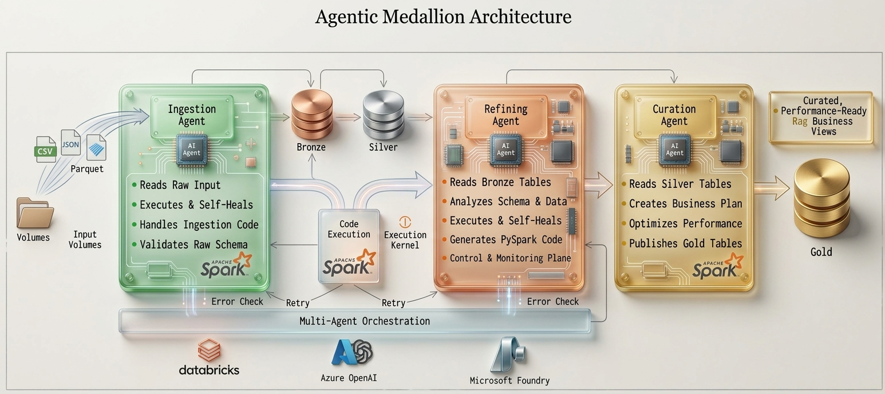

## End-to-End MultiAgent Project

### Self-Healing Agentic Data Pipeline (Databricks + AI)

**Problem Statement**

Traditional data pipelines are typically built using **static and predefined transformation logic**. While effective for stable data environments, these pipelines can become difficult to maintain when data structures, schemas, or data-quality conditions change

They require:
- Manual development and maintenance of data transformation logic 
- Continuous monitoring and debugging when pipeline failures occur 
- Separate logic for different datasets
- Significant engineering effort to accommodate schema or data quality changes  

As a result, pipelines are **rigid, time-consuming, and difficult to scale**.

## Objective

The objective of this project is to develop an **AI-powered, self-healing data pipeline** using Databricks and a multi-agent architecture:
The proposed system is designed to:
- Automatically ingest and process data
- Dynamically adapt to different datasets and schemas
- Generate appropriate PySpark transformation logic
- Detect data processing and execution failures
- Identify potential causes of failures
- Automatically generate corrective actions
 

> The goal is to move from **manual data engineering** to **intelligent, agent-driven pipelines**.

---

## Overview
This project demonstrates a **Self-Healing Agentic Data Pipeline** built on Databricks using **AI-powered agents**.

Instead of writing static ETL logic, this system uses **LLM-driven agents** that can:
- Generate PySpark code dynamically
- Execute data ingestion and transformation
- Detect failures and automatically fix errors (self-healing)

---

## Key Idea
> “Let AI behave like a Data Engineer — writing, executing, and fixing code automatically.”

## Features

- Fully dynamic ingestion (no hardcoded logic)  
- Table-agnostic data cleaning  
- AI-generated PySpark transformations  
- Self-healing retry mechanism  
- Scalable multi-agent architecture  

---

## Why This Project?

Traditional pipelines:
- Require manual coding  
- Break on schema changes  
- Need constant maintenance  

This system:
- Adapts automatically  
- Reduces manual effort  
- Handles failures intelligently  

---
